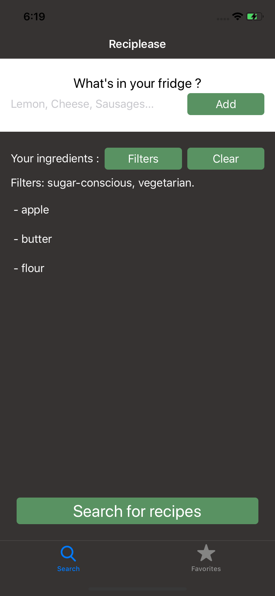
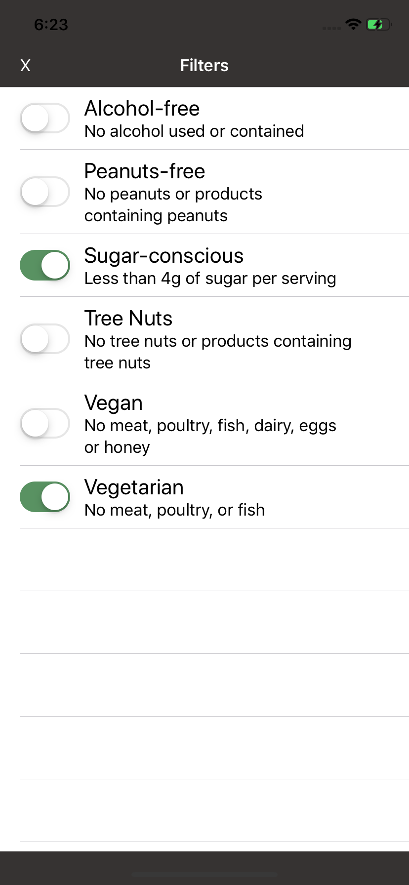
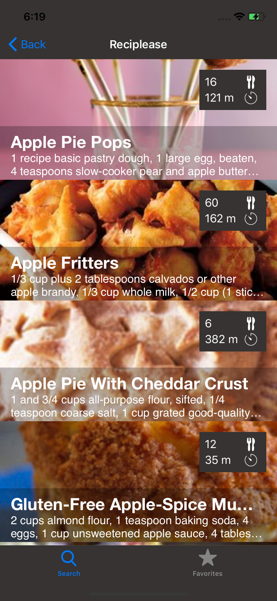
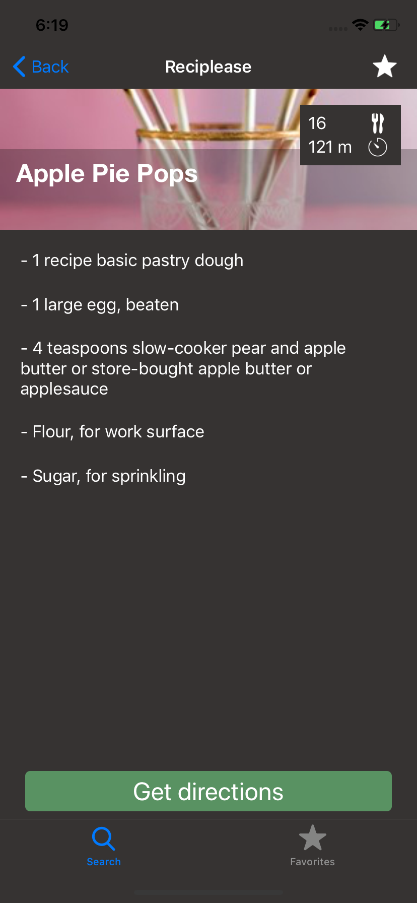
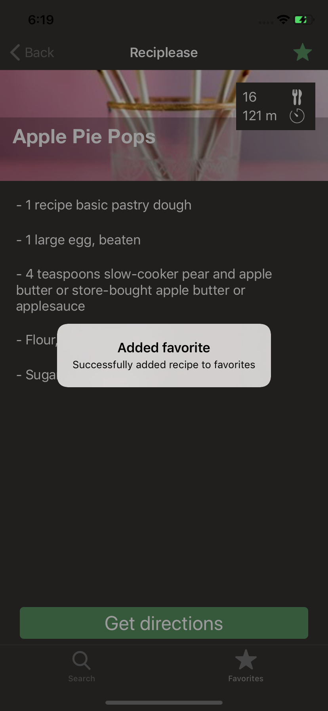
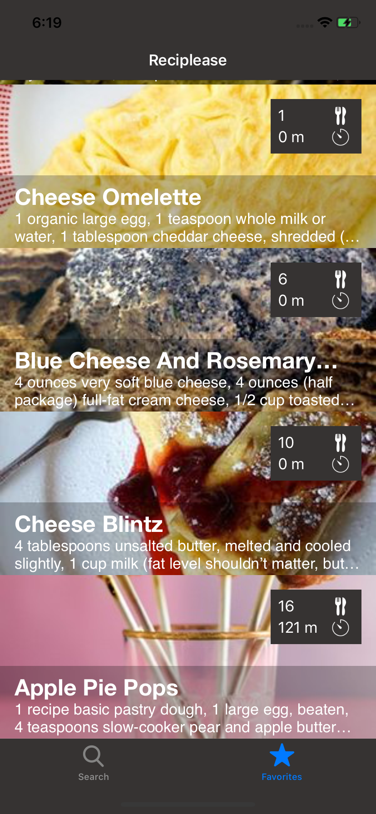

# Reciplease
App that finds recipes for you for given ingredients

 

# Ingredients list
Here, you can add all the ingredients that you have and want to cook with.

# Filters
You can specify filters to exclude recipes. There are 6 filters available for now on. These filters will be stored, so you don't have to specify them each time you are looking for a recipe.

# Search
When you tap the search button, a list of recipes matching your criterias is shown.

# Detail
You can then tap a recipe to see the ingredients required, and get the link to the full recipe.

# Favorite
You can then tap the star to add or remove a recipe from your favorites.

# Get directions
The button "Get Directions" will get you to the full recipe, through your browser.

# Favorite list
At any time, you can see all the recipes in your favorites by clicking the tab bar.

